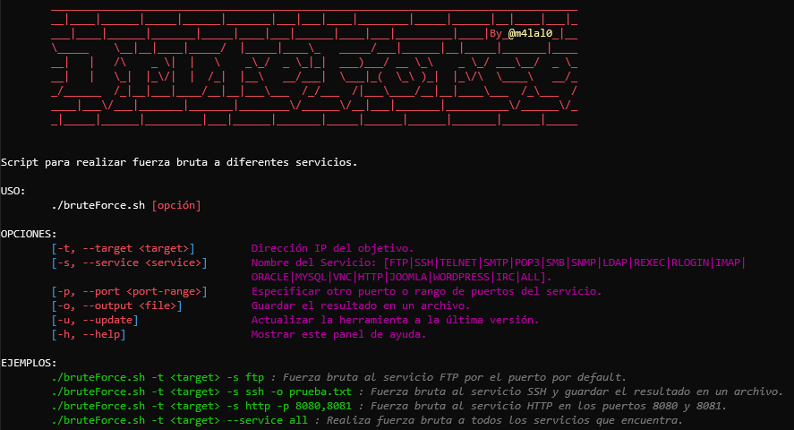

# BruteForce

[](#)
[](#)
[](#)
[](#)
[](#)
[](#)

<p align="center">
┏━━┓━━━━━━━━━┏┓━━━━━━━━━━┏━━━┓━━━━━━━━━━━━━━━
┃┏┓┃━━━━━━━━┏┛┗┓━━━━━━━━━┃┏━━┛━━━━━━━━━━━━━━━
┃┗┛┗┓┏━┓┏┓┏┓┗┓┏┛┏━━┓━━━━━┃┗━━┓┏━━┓┏━┓┏━━┓┏━━┓
┃┏━┓┃┃┏┛┃┃┃┃━┃┃━┃┏┓┃━━━━━┃┏━━┛┃┏┓┃┃┏┛┃┏━┛┃┏┓┃
┃┗━┛┃┃┃━┃┗┛┃━┃┗┓┃┃━┫━━━━┏┛┗┓━━┃┗┛┃┃┃━┃┗━┓┃┃━┫
┗━━━┛┗┛━┗━━┛━┗━┛┗━━┛━━━━┗━━┛━━┗━━┛┗┛━┗━━┛┗━━┛
━━━━━━━━━━━━━━━━━━━━━━━━━━━━━━━━━━━━━━━━━━━━━
━━━━━━━━━━━━━━━━━━━━━━━━━━━━━━━━━━━━━━━━━━━━━

Pequeño script en Bash para realizar fuerza bruta a diferentes servicios
</p>

## Instalación y Uso

```bash
git clone https://github.com/m4lal0/bruteForce
cd bruteForce; chmod +x bruteForce.sh
./bruteForce.sh
```

Al ejecutarlo nos mostrará un panel de ayuda:



Con los parámetros definidos, en función del servicio seleccionado... se despleglará todo lo necesario de forma automática.